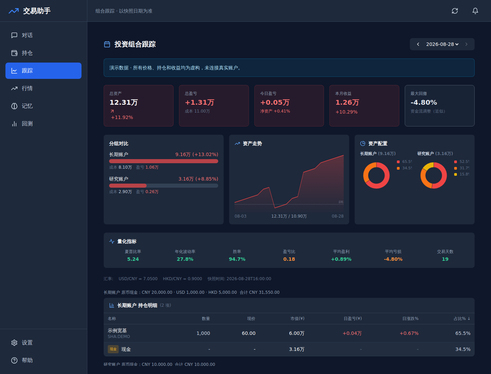
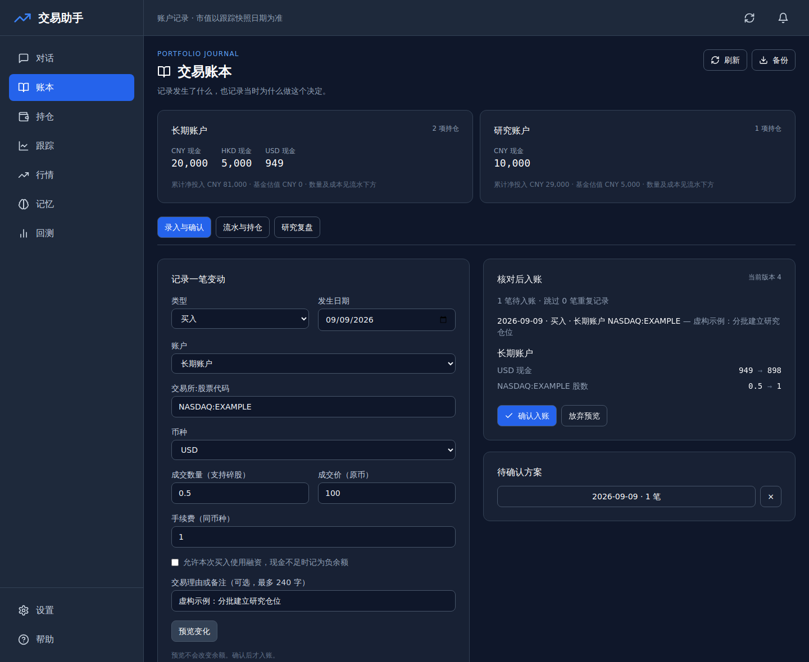
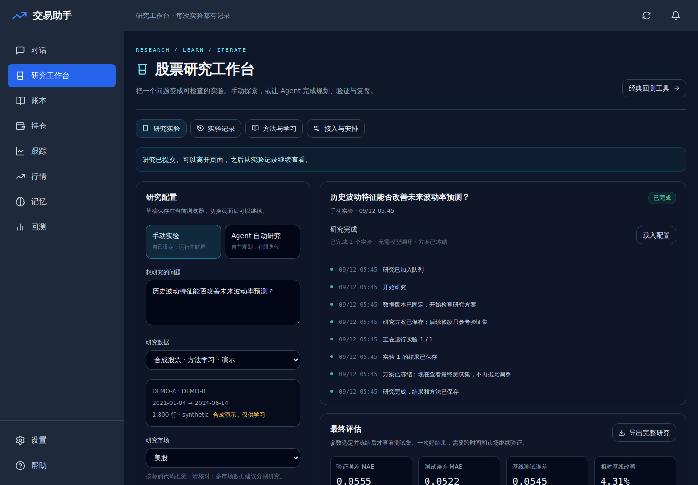

<div align="center">

# 📊 Portfolio Daily Tracker

**Self-hosted portfolio journaling and agent-driven stock research**

**自托管投资组合记录与 Agent 股票研究工作台**

[](https://github.com/Stepuuu/portfolio-daily-tracker/actions/workflows/checks.yml)
[](LICENSE)
[](https://python.org)
[](https://reactjs.org)
[](https://clawhub.ai)

**📖 Documentation / 文档**

[🇬🇧 English](README_EN.md) · [🇨🇳 中文](README_CN.md) · [Feishu workbench / 飞书工作台](docs/FEISHU_WORKBENCH.md)

</div>

---

### News / Versions

| Version / 版本 | Date / 日期 | Updates / 更新摘要 |
|---|---|---|
| [v3.2.1](https://github.com/Stepuuu/portfolio-daily-tracker/releases/tag/v3.2.1) | 2026-09-14 | Feishu daily batches now support deposits, withdrawals and principal reconciliation, with linked cash/capital updates and final-balance overrides.<br>飞书每日清单新增资金转入、转出及本金核对；现金与本金联动，最终余额对账避免重复计算。 |
| [v3.2.0](https://github.com/Stepuuu/portfolio-daily-tracker/releases/tag/v3.2.0) | 2026-09-12 | Added reproducible manual/Agent stock research, persistent jobs, model connections and CLI/HTTP/MCP extensions; a [Feishu card workbench](docs/FEISHU_WORKBENCH.md) adds one-click daily reports, confirmed multi-account batches, assets and research after setup.<br>新增可复查的手动与 Agent 股票研究、持久化任务、模型接入及 CLI/HTTP/MCP 扩展；[飞书卡片工作台](docs/FEISHU_WORKBENCH.md)经配置后支持无变动一键更新、多账户变动清单统一确认、资产查看与研究任务。 |
| [v3.1.0](https://github.com/Stepuuu/portfolio-daily-tracker/releases/tag/v3.1.0) | 2026-09-09 | Added a confirmed transaction ledger and research journal, with CSV deduplication, multi-currency accounting fixes and an offline demo.<br>新增需确认的交易账本与研究日志，支持 CSV 去重，修复多币种核算并提供离线演示。 |
| [V3 · AI assistant / AI 助手](CHANGELOG.md#v3--ai-trading-assistant) | 2026-03-08† | Combined portfolio tracking with AI chat, a React dashboard, strategy backtesting and scheduled reports.<br>整合投资组合追踪、AI 对话、React 面板、策略回测与定时日报。 |
| [V2 · Self-hosted engine / 自托管引擎](CHANGELOG.md#v2--self-hosted-portfolio-engine) | 2026-03-08† | Moved tracking to Python with local JSON/CSV storage, multi-market quotes, risk metrics and automated reports.<br>转为 Python 自托管，使用本地 JSON/CSV，支持多市场行情、风险指标与自动日报。 |
| [V1 · Google Sheets](CHANGELOG.md#v1--google-sheets) | 2025-09-25† | Started with Google Sheets and Apps Script for daily snapshots, price updates, asset charts and monthly P&L.<br>基于 Google Sheets 与 Apps Script，实现每日快照、行情更新、资产图表与月度盈亏记录。 |

† Historical milestones: V1 uses the earliest dated guide entry; V2 and V3 were first recorded together in the repository. These are not tagged release dates.<br>
† 历史里程碑：V1 日期取自最早的指南更新记录；V2 与 V3 首次收录于同一次仓库提交。这些日期不代表正式 Release 发布日。

[Full changelog / 完整更新记录](CHANGELOG.md) · [GitHub Releases](https://github.com/Stepuuu/portfolio-daily-tracker/releases) · [Roadmap / 后续计划](docs/ROADMAP.md)

### Highlights / 亮点

| | Feature | 功能 |
|---|---------|------|
| 🌍 | Multi-market: A-shares, HK, US | 多市场：A 股、港股、美股 |
| 📈 | Sharpe, volatility, max drawdown | 夏普、波动率、最大回撤 |
| 🤖 | AI chat with GPT / Claude / DeepSeek | AI 对话助手 |
| 🔬 | Manual and autonomous stock research | 手动实验与 Agent 自动股票研究 |
| 📊 | Transaction ledger and research journal | 交易账本与研究复盘 |
| 📉 | Strategy backtesting engine | 策略回测引擎 |
| 🔔 | Auto daily report → Feishu / Telegram | 每日自动推送日报 |
| 🦞 | OpenClaw agent skill on ClawHub | OpenClaw 技能已发布 |

### Try it with fictional data / 先体验演示数据



Requires **Python 3.10+**, **Node.js 22.12+** and Bash 4.3+ for the local launcher.
After `make setup`, run `make demo` and open [the tracker](http://localhost:3000/tracker).
The demo needs no API key: portfolio records are read-only, and synthetic manual
research uses separate storage. It never overwrites your holdings.

Record trades with fees and fractional shares, preview every balance change, and
confirm once. Import standard CSV with duplicate detection, reverse mistakes,
back up the ledger, and keep a thesis with a review date for each security.
Native CNY/HKD/USD cash, valuation guards and flow-adjusted drawdown make the
accounting assumptions visible. AI prepares proposals for your review.

**[Ledger guide / 账本使用说明](docs/LEDGER.md)** · **[Release notes](CHANGELOG.md)**


See [accounting conventions](docs/ACCOUNTING.md), [planned work](docs/ROADMAP.md),
[changes](CHANGELOG.md) and [deployment scope](SECURITY.md).

### Stock research workbench / 股票研究工作台



After setup, run `make lab` and open [the workbench](http://localhost:3000/lab).
Start a manual experiment on synthetic data without credentials or account setup.
Import stock daily bars from CSV, local cache or a market provider; compare momentum,
mean-reversion and volatility methods against a baseline, with time-ordered splits,
label-boundary purging, costs, curves and reproducible records.

Agent mode plans experiments, reviews validation evidence within a budget, freezes
a candidate and evaluates its final test result. Connect an API or an existing
official Codex/Claude Code login. Persistent jobs support cancellation, retries,
schedules and JSON export; CLI, HTTP, MCP and Python registration support extensions.
Connection checks do not guarantee model access or subscription quota.

研究从问题、数据与模板开始，支持手动实验和有次数、时间上限的 Agent 自动研究；
历史记录可以比较、取消、重试和导出。当前聚焦股票日线方法学习与验证，不包含期权回测或实盘下单。

Research data is stored locally. Remote model connections receive research context;
exports are **not automatically redacted**. 研究数据保存在本机；远程模型会收到研究上下文，导出不会自动脱敏。

**[Research guide](docs/RESEARCH.md)** · **[中文研究指南](docs/RESEARCH_CN.md)** ·
**[Extension interfaces](docs/RESEARCH_EXTENSIONS.md)**

### Quick Start / 快速开始

```bash
git clone https://github.com/Stepuuu/portfolio-daily-tracker.git
cd portfolio-daily-tracker
python3 -m venv .venv
source .venv/bin/activate
make setup
make lab   # research without account setup; open /lab
# make demo   # fictional portfolio and synthetic manual research
# make start  # your configured portfolio plus research
# Open http://localhost:3000
```

Docker is optional. The commands above run directly on a host or inside an existing container.
For users with a Docker host:
```bash
docker compose up -d
```

**OpenClaw Skill:**
```bash
clawhub install portfolio-daily-tracker
```

See full documentation: [English](README_EN.md) · [中文](README_CN.md)

---

### Contributing / 贡献

We welcome issues, feature requests, and pull requests!
If you find a bug, have an idea, or want to improve the code, please open an [issue](https://github.com/Stepuuu/portfolio-daily-tracker/issues) or submit a [pull request](https://github.com/Stepuuu/portfolio-daily-tracker/pulls).

欢迎提交 Issue、功能建议和 Pull Request！
如果你发现了 Bug、有改进想法或希望贡献代码，请在 [Issues](https://github.com/Stepuuu/portfolio-daily-tracker/issues) 中反馈，或直接提交 [PR](https://github.com/Stepuuu/portfolio-daily-tracker/pulls)。

---

### Citation / 引用

If this project helps your research or workflow, please cite it:

如果本项目对你的研究或工作有帮助，欢迎引用：

```bibtex
@misc{portfolio-daily-tracker,
  author       = {Stepuuu},
  title        = {Portfolio Daily Tracker — Self-hosted Investment Portfolio Tracking \& AI Trading Assistant},
  year         = {2026},
  publisher    = {GitHub},
  howpublished = {\url{https://github.com/Stepuuu/portfolio-daily-tracker}},
}
```

---

<div align="center">
  <b>📊 Manage your investments with code · 用代码管理你的投资</b><br>
  <b>Powered by OpenClaw 🦞</b><br>
  <a href="https://github.com/Stepuuu/portfolio-daily-tracker">GitHub</a> ·
  <a href="https://clawhub.ai">ClawHub</a> ·
  MIT License
</div>
