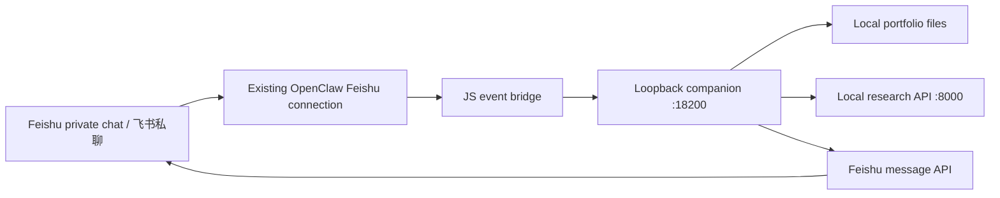

# Feishu workbench / 飞书工作台

Part of **v3.2.0**. Use native cards in a bot's private chat to record daily portfolio changes, inspect assets, and run stock research. Setup is required: installing the repository or ClawHub skill does **not** automatically install an event handler, publish a bot menu, or validate your application's callbacks.

本功能整合在 **v3.2.0**：通过机器人私聊中的原生卡片完成每日组合记录、资产查看和股票研究。需要先配置本机服务与飞书应用；安装仓库或 ClawHub 技能**不会自动接入事件、发布菜单或完成当前应用的回调验收**。

## Architecture / 接入方式



The [bridge module](../openclaw/feishu-workbench-bridge.mjs) reuses the Feishu plugin's existing authenticated connection. The [companion](../dashboard/feishu_workbench/) accepts authenticated loopback requests, stores commands before executing them, and sends or updates Card 2.0 messages through the same bot application. It does not require a public webhook or another WebSocket consumer.

[JS 桥接模块](../openclaw/feishu-workbench-bridge.mjs)复用 Feishu 插件已有的认证连接。[本机伴随服务](../dashboard/feishu_workbench/)只接收带令牌的 loopback 请求，将操作持久化后执行，并通过同一机器人应用发送或更新 Card 2.0。无需额外公网回调地址，也无需再启动一个长连接消费者。

## 1. Prepare the local services / 准备本机服务

Use Linux, Python 3.10+, and the project's Node.js 22.12+ toolchain. The process manager needs Linux `pidfd` support, supplied by Python or libc. OpenClaw's Feishu connection and the companion must share access to the private bridge token, normally under the same operating-system user. No Docker setup is required.

使用 Linux、Python 3.10+ 和项目要求的 Node.js 22.12+。启动管理器需要 Linux `pidfd` 支持，可由 Python 或 libc 提供。OpenClaw 的 Feishu 连接与伴随服务需要读取同一份私有桥接令牌，通常应由同一系统用户运行。无需配置 Docker。

Run these commands from the repository root. / 以下命令均在仓库根目录执行。

```bash
python3 -m venv .venv
source .venv/bin/activate
make setup
make lab
```

If the environment is already installed, reuse it. Keep the research API available at `http://127.0.0.1:8000`; use your actual loopback port if different. `make lab` supports research without portfolio setup. Daily updates require an existing dated portfolio, described in the [full guide](FULL_GUIDE_CN.md); this installer does not create or import personal holdings.

已经安装时复用现有环境即可。研究 API 应运行在 `http://127.0.0.1:8000`；若使用其他本机端口，在下方配置中相应修改。`make lab` 可独立运行研究；每日更新需要按[完整指南](FULL_GUIDE_CN.md)初始化已有日期持仓，工作台安装器不会创建或导入个人持仓。

### Initialize private configuration / 初始化私有配置

Obtain your own `open_id` for **this bot application**. The allowlist is mandatory. Its members can access the same portfolio and research workspace; it is not account-level or tenant-level isolation.

先取得**当前机器人应用下**自己的 `open_id`。必须设置明确白名单；白名单成员共享同一套组合和研究工作区，并不按账户或租户隔离。

```bash
read -r -p "Owner open_id: " QR_OWNER_OPEN_ID
export QR_OWNER_OPEN_ID

PYTHONPATH=dashboard python -m feishu_workbench init \
  --project-dir . \
  --allowed-user "$QR_OWNER_OPEN_ID" \
  --lab-url http://127.0.0.1:8000 \
  --account-id qr
```

`qr` is the OpenClaw **connection account name**, not a portfolio account or a Feishu App ID. Change it consistently if your connection uses another name. Repeat `--allowed-user` only for people who should have access to this entire workspace.

`qr` 是 OpenClaw 的**连接账户名**，不是投资账户名或飞书 App ID。已有连接使用其他名字时，需要同步修改所有相关配置。只有需要访问整套工作区的人才应加入 `--allowed-user`。

The initializer creates `dashboard/data/feishu-workbench/config.json` and `bridge.token` with mode `0600`, inside a `0700` directory. It generates a random token, records the resolved runtime paths, and refuses to overwrite an existing state directory. Keep these files private and untracked. A short token or a token/config file readable by other users is rejected.

初始化器会在 `0700` 目录下创建 `0600` 权限的 `dashboard/data/feishu-workbench/config.json` 和 `bridge.token`，生成随机令牌并写入解析后的运行路径。已有目录不会被覆盖。这些文件应保留在本机，不加入版本控制；过短的令牌或其他用户可读的令牌、配置文件会被拒绝。

Choose one credential source for the companion. / 为伴随服务选择一种凭证来源。

- **Existing OpenClaw configuration:** when initializing, append `--openclaw-config "$OPENCLAW_CONFIG_FILE"`, after setting that variable to your private config file. The selected entry must contain `channels.feishu.accounts.<account-id>.appId` and `appSecret`. The file remains local; secrets are not copied into the workbench config.
- **Environment variables:** if `--openclaw-config` is omitted, the companion reads `FEISHU_APP_ID` and `FEISHU_APP_SECRET`. They must identify the same bot used by the bridge. Set them before starting the companion, for example with the prompts below.
- **复用 OpenClaw 配置：**首次初始化时追加 `--openclaw-config "$OPENCLAW_CONFIG_FILE"`，变量指向本机私有配置。所选条目应包含 `channels.feishu.accounts.<account-id>.appId` 和 `appSecret`，凭证不会复制进工作台配置。
- **环境变量：**省略该参数时，伴随服务读取 `FEISHU_APP_ID` 和 `FEISHU_APP_SECRET`，必须与桥接连接使用同一机器人。启动服务前可使用以下交互输入，避免把密钥写进命令文本。

```bash
read -r -p "Feishu App ID: " FEISHU_APP_ID
read -r -s -p "Feishu App Secret: " FEISHU_APP_SECRET
export FEISHU_APP_ID FEISHU_APP_SECRET
```

For Lark, use `domain: "lark"` in the private workbench config when using environment credentials, or the domain configured in the selected OpenClaw account. Only the official Feishu and Lark API domains are supported.

使用 Lark 时，环境变量凭证模式需在私有工作台配置中设置 `domain: "lark"`；复用 OpenClaw 时读取所选连接的域名设置。仅支持飞书与 Lark 官方 API 域名。

### Start, inspect, stop / 启动、查看、停止

```bash
PYTHONPATH=dashboard python -m feishu_workbench.control start \
  --config dashboard/data/feishu-workbench/config.json

PYTHONPATH=dashboard python -m feishu_workbench.control status \
  --config dashboard/data/feishu-workbench/config.json

# Stop when no workbench operation is running / 无工作台操作执行时停止
PYTHONPATH=dashboard python -m feishu_workbench.control stop \
  --config dashboard/data/feishu-workbench/config.json
```

Start again after stopping when continuing setup. The companion binds `127.0.0.1:18200`; an occupied port is an error. The manager identifies its own process and will not replace an unrelated service. It refuses a managed stop while operations are running. Starting the companion does not enable startup at boot or start the research API.

继续配置时需要重新执行 `start`。伴随服务监听 `127.0.0.1:18200`，端口被占用时会报错。管理器核实自身进程，不会替换其他服务；操作执行中会拒绝停止。启动伴随服务不会设置开机自启，也不会代为启动研究 API。

## 2. Connect the existing Feishu handler / 接入现有 Feishu 处理器

The bridge exports `dispatchWorkbenchEvent`; it is not an automatically registered OpenClaw plugin. Integrate it with the existing Feishu plugin's event dispatcher for the configured account. The exact integration file depends on your installed plugin version. Preserve existing handlers, especially other applications' card interactions.

桥接模块导出 `dispatchWorkbenchEvent`，它不是会自动注册的 OpenClaw 插件。需要将它接入所用 Feishu 插件已有的事件分发器，具体文件位置取决于插件版本。保留原有处理器，尤其是其他卡片交互。

Set these variables in the environment of the **OpenClaw process**, not only the companion shell. The paths below are derived from the repository root. Do not place the token itself in plugin source or logs.

以下环境变量必须由 **OpenClaw 进程**读取，不能仅设置在伴随服务的终端里。路径从仓库根目录生成；不要将令牌内容写入插件源码或日志。

```bash
export QR_WORKBENCH_ACCOUNT_ID=qr
export QR_WORKBENCH_BRIDGE_URL=http://127.0.0.1:18200/bridge/event
export QR_WORKBENCH_BRIDGE_MODULE="$(pwd)/openclaw/feishu-workbench-bridge.mjs"
export QR_WORKBENCH_BRIDGE_TOKEN_FILE="$(pwd)/dashboard/data/feishu-workbench/bridge.token"
```

The following is an integration pattern, **not a standalone installer**. Here `handlers` is the plugin's existing handler map and `accountId` is the current authenticated connection. Apply the wrapper before the map is registered with its existing dispatcher. Pass the original event unchanged, and return the bridge's result to Feishu. Only `null` means “continue to the original handler”; `{}` means the event was accepted for asynchronous processing.

以下是接入模式，**不是可独立运行的安装器**。其中 `handlers` 指插件已有的处理器表，`accountId` 指当前已认证连接。应在该表注册进现有分发器前包装处理器，原样转发事件，并将返回值交还飞书。只有 `null` 才继续调用原处理器，`{}` 也表示已接收并异步处理。

```js
import { pathToFileURL } from 'node:url';

const { dispatchWorkbenchEvent } = await import(
  pathToFileURL(process.env.QR_WORKBENCH_BRIDGE_MODULE).href
);
for (const eventType of [
  'im.message.receive_v1',
  'card.action.trigger',
  'application.bot.menu_v6',
  'im.chat.access_event.bot_p2p_chat_entered_v1',
]) {
  const previous = handlers[eventType];
  handlers[eventType] = async (event) => {
    const response = await dispatchWorkbenchEvent({ accountId, eventType, event });
    if (response !== null) return response;
    return previous ? previous(event) : {};
  };
}
```

Do not create a second Feishu connection for this bridge. Its 1.8-second deadline covers queue acceptance, not completion of a report or experiment. Slow work runs in the companion, which updates the message afterwards. A bridge timeout does not prove that an operation was rejected; inspect its state before trying again.

不要为桥接模块创建第二条飞书连接。桥接的 1.8 秒时限用于确认任务是否接收，不用于等待日报或实验完成；耗时任务由伴随服务执行，随后更新卡片。桥接超时不表示任务一定未被接收，应先核对状态再决定是否重试。

## 3. Configure the Feishu console / 配置飞书控制台

Use a bot application that is available to the intended users. Enable the application permissions required to send messages as the bot, update its own messages, and receive private messages. If enabling entry events, also enable the permission shown for the [bot private-chat entry event](https://open.feishu.cn/document/group/chat-member/event/bot_p2p_chat_entered). No workspace-wide document or trading permissions are needed for this companion.

使用对目标用户可见的机器人应用，启用以应用身份发消息、更新自身消息、接收用户私聊消息所需的应用权限。启用进入私聊事件时，还需开通[该事件文档](https://open.feishu.cn/document/group/chat-member/event/bot_p2p_chat_entered)列出的权限。此伴随服务无需工作区文档权限或交易权限。

Configure the existing long-connection delivery mode under **Events & Callbacks**. Event subscriptions and callback subscriptions are separate settings; a working text conversation does not prove that card callbacks are configured. See the [official card callback setup reference](https://github.com/larksuite/cli/blob/main/skills/lark-im/references/lark-im-card-action-reply.md).

在**事件与回调**中使用已有长连接的投递方式。事件订阅与回调订阅是不同配置；文字聊天正常并不代表卡片回调已配置。参见[官方卡片回调配置说明](https://github.com/larksuite/cli/blob/main/skills/lark-im/references/lark-im-card-action-reply.md)。

**Required:** open the application's **Events & Callbacks → Callback Configuration**, enable **Card interaction callback (`card.action.trigger`)**, and select delivery through the existing long connection. Save and publish the configuration as required by the console. The companion cannot enable this setting for the application.

**必做：**进入当前应用的**事件与回调 → 回调配置**，启用**卡片回传交互（`card.action.trigger`）**，选择使用已有长连接接收回调，并按控制台要求保存、发布配置。伴随服务不能代替应用开启此配置。

| Console area / 控制台位置 | Identifier / 标识 | Purpose / 用途 |
|---|---|---|
| Event configuration / 事件配置 | `im.message.receive_v1` | Required for the exact text entry command / 精确文字入口需要 |
| Callback configuration / 回调配置 | `card.action.trigger` | Required for buttons and forms / 按钮和表单必需 |
| Event configuration / 事件配置 | `application.bot.menu_v6` | Optional native menu / 可选原生菜单 |
| Event configuration / 事件配置 | `im.chat.access_event.bot_p2p_chat_entered_v1` | Optional initial card on private-chat entry / 可选首次进入私聊时打开卡片 |

For a native menu, configure **Bot → Custom Menu** with event actions, then publish the app configuration through the console. Start with three main entries below; `qrw_home` is also supported for a homepage entry. The [official menu event reference](https://open.feishu.cn/document/uAjLw4CM/ukTMukTMukTM/application-v6/bot/events/menu) describes the menu event.

原生菜单需要在**机器人 → 自定义菜单**中配置事件动作，并通过控制台发布应用配置。建议使用以下三个主入口；也支持通过 `qrw_home` 打开主页。菜单事件见[官方说明](https://open.feishu.cn/document/uAjLw4CM/ukTMukTMukTM/application-v6/bot/events/menu)。

| Menu label / 菜单名称 | `event_key` |
|---|---|
| 每日更新 / Daily update | `qrw_daily` |
| 资产总览 / Assets | `qrw_assets` |
| 研究任务 / Research | `qrw_research` |

Menu publishing is a separate console action; the repository does not perform it. Without a menu, an allowlisted user can send exactly **`工作台`**, **`QR工作台`**, or **`/workbench`** in the bot's private chat. Additional prose is not interpreted as a workbench command. Re-entering a chat that already has a workbench card does not automatically send another one.

菜单发布是单独的控制台操作，仓库不会自动执行。没有菜单时，白名单用户仍可在机器人私聊中发送精确文本 **`工作台`**、**`QR工作台`** 或 **`/workbench`**。附带其他描述的文字不会作为工作台命令；已有工作台卡片的会话再次进入时，不会自动重复发卡。

After setup, this optional command **sends a real card** to `initial_user` from the allowlist. Reusing the same `--request-id` avoids reopening it as a separate request. It is not an offline preview.

配置完成后，以下可选命令会向白名单中的 `initial_user` **实际发送卡片**。重复使用相同的 `--request-id` 可避免作为新请求重复打开；这不是离线预览命令。

```bash
PYTHONPATH=dashboard python -m feishu_workbench open \
  --config dashboard/data/feishu-workbench/config.json \
  --panel home --request-id first-workbench
```

## Using the cards / 使用卡片

| View / 页面 | Workflow / 操作 |
|---|---|
| Home / 主页 | Daily update, assets, research; reports as a secondary entry / 每日更新、资产总览、研究任务，另有日报入口 |
| Daily update / 每日更新 | One-click unchanged update, or a resumable list of changes across accounts and products, followed by one confirmation / 无变动一键更新；有变动则逐项添加账户与产品，统一核对确认 |
| Assets / 资产 | Read saved positions and each account's original-currency cash; the legacy fund total is CNY / 查看已保存持仓与各账户原币现金，旧版基金合计估值为 CNY |
| Research / 研究 | Select an existing dataset, template and manual/Agent mode; review configuration, then start / 选择已有数据集、模板和手动或 Agent 模式，核对配置后启动 |
| History / 研究记录 | Select from up to 20 recent tasks; inspect progress or results, refresh, or cancel a pending/running task / 从最多 20 项近期任务中选择，查看进度或结果、刷新或取消等待中及运行中任务 |
| Reports / 日报 | Inspect recent saved reports and report-job status; retry a failed report separately / 查看近期已保存日报和更新状态，可单独重试失败的日报任务 |

**No change:** press **今日无变动，更新日报** to confirm that all accounts are unchanged and start the configured daily report. There are no fields or additional preview. The displayed date uses Asia/Shanghai. This button is unavailable while a draft contains unsaved changes.

**With changes:** open **有变动**, then add each buy, sell, cash balance or fund valuation to the list. Each entry selects its own account; one batch can update one account or several. Existing products are selected from that account's holdings, including earlier entries in the draft. Sells support a specified quantity or the full remaining position. A new buy requires an explicit market-prefixed code, such as `NASDAQ:EXAMPLE`; trade currency follows the market. Quantities are shares and prices/fees use that currency.

The list supports up to **30 entries**, editing, deleting, changing the common date, and leaving/reopening the workbench. Drafts are stored locally per user and do not change holdings. Trades are calculated in list order. A cash reconciliation is a **final balance after all trades**, regardless of where it was added in the list; it replaces calculated cash for that account and currency. Fund reconciliation changes only that account's **CNY fund total valuation**, independently of cash, and does not record a subscription or redemption. Enter each account/currency balance only once; edit that entry to correct it. Exchange-traded ETF purchases and sales use the buy/sell path. Negative resulting cash is disclosed for reconciliation, not treated as a broker financing instruction.

**核对全部变动** shows every trade and each affected account's final cash and fund valuation. Untouched accounts remain unchanged. Confirm once to save the entire list and queue one report. If a save is interrupted, reopen the list and use **继续处理** to recover the same update; confirmed trades are not applied again. When the underlying holdings or draft changes after preview, review a fresh preview.

**无变动：**点击 **今日无变动，更新日报**，即确认所有账户无变化并更新日报，无需填写表单或再次预览。日期以北京时间为准；清单中有未保存变动时，该按钮不可用。

**有变动：**逐项添加买入、卖出、现金余额或基金估值，每项单独选择账户，支持一个账户或多个账户一起更新。产品从所选账户的持仓中选择，已加入清单的买卖也会计入可选持仓；卖出支持指定数量或全部卖出。买入新产品时填写带市场前缀的代码，成交币种按市场确定。数量按股填写，单价和手续费使用对应币种。

清单最多 **30 项**，可以修改、删除、调整记账日期，退出工作台后也能继续填写。加入清单不会修改实际持仓。买卖按清单顺序计算；**现金对账始终表示所有买卖后的最终余额**，与加入清单的先后顺序无关。每个账户、每种币种只填写一次最终余额，需要更正时修改该项。基金估值仅更新该账户的 CNY 基金合计，现金单独记录，不表示申购或赎回；场内 ETF 买卖使用买入、卖出入口。最终现金为负时会明确提示核对，不会向券商申请融资。

点击 **核对全部变动**，检查每笔买卖及各账户最终现金、基金估值，再统一保存并生成一份日报。未添加变动的账户保持原样。保存中断时，重新打开清单后点击 **继续处理**，会恢复同一次更新，避免重复入账。预览后持仓或清单发生变化时，需要重新核对。

The card edits the existing **dated JSON holdings** workflow. It does not place broker orders. When the transaction ledger is active, the legacy adapter refuses to overwrite holdings; use the existing [ledger preview and confirmation UI](LEDGER.md). Card updates do not provide a second ledger implementation. Assets reflect saved records; opening or refreshing the asset card does not fetch live quotes or invent missing valuations.

卡片使用现有的**按日期保存的 JSON 持仓**流程，不向券商下单。交易账本已启用时，旧持仓适配器会拒绝覆盖，需继续使用已有[账本预览与确认界面](LEDGER.md)。卡片没有另建一套账本。资产反映已保存记录，打开或刷新资产卡不会抓取实时行情，也不会补造缺失估值。

Financial changes require a separate confirmation. If the holdings change after preview, generate a new preview. Commands, card revisions and nonces are stored locally to reject stale actions and deduplicate repeated clicks; confirmation also has a persistent operation identifier. A saved-asset receipt and report completion are separate states. After confirmation, the existing daily pipeline can fetch quotes and **send reports to its already configured Feishu/Telegram destinations**, which may differ from the card's private chat. Verify those destinations before using daily confirmation. Retry a failed report from Reports; it does not repeat the asset mutation. An uncertain delivery state may require manual inspection rather than automatic resend.

资产变化必须单独确认；预览后持仓发生变化时，需要重新预览。本机保存命令、卡片版本和一次性操作标识，拒绝旧操作并对重复点击去重，确认也使用持久化操作编号。**资产已保存**与**日报已完成**是不同状态。确认后，原有日报管道可能获取行情，并**推送到已配置的飞书或 Telegram 目标**，这些目标可能不同于当前卡片私聊；使用前请核对。失败日报可从“日报”单独重试，不会重复修改资产。发送状态无法确认时，系统可能要求人工核查，而不是自动重发。

Research cards reuse existing [research datasets, templates and model connections](RESEARCH.md). Configure API providers, third-party compatible providers, or an available official Codex/Claude Code subscription connection through the research connection settings. A subscription or configured key does not guarantee model availability or quota. Cards do not collect API keys, import CSV files, or configure model connections. Initial dataset and connection setup uses the research UI, CLI or API; daily operation of configured experiments can stay in Feishu.

研究卡片复用已有[数据集、模板和模型连接](RESEARCH_CN.md)。通过研究连接设置接入 API、第三方兼容服务，或可用的官方 Codex/Claude Code 订阅连接；已配置密钥或订阅不保证模型权限与额度可用。卡片不收集 API Key，也不提供 CSV 导入和连接配置表单。首次准备数据与连接使用研究界面、CLI 或 API，配置好的日常实验操作可在飞书内完成。

Manual research does not call a model. Agent research discloses that the selected model receives the research question, dataset metadata and computed evidence before the user confirms startup; it then runs within the displayed experiment and time budgets. Progress can update asynchronously, and cancellation is a request rather than an immediate completion guarantee. Final cards include evaluation metrics, curves where available, and learning/method notes. Research is for studying and evaluating stock methods, not automatic live trading.

手动实验不调用模型。Agent 启动预览会说明研究问题、数据元信息和计算证据将发送给所选模型，用户确认后才在所示次数与时间预算内运行。进度可异步更新；取消是请求，不代表立即停止。结果卡展示评价指标、可用曲线和学习及方法说明。这些能力用于股票方法学习与验证，不执行自动实盘交易。

## Privacy and troubleshooting / 数据边界与故障处理

Private-chat cards are messages stored by Feishu. Disabling card forwarding is not a confidentiality boundary: recipients can still read or capture the content. Only allow trusted workspace owners. The loopback token, application credentials, local session databases, logs, portfolio files and research exports must remain private. Research exports are not automatically redacted. The callback bridge does not send these operations to a chat model; remote model transmission occurs when an Agent research connection is explicitly used.

私聊卡片仍是由飞书存储的消息。关闭卡片转发不是保密边界，接收者仍可阅读或截图。只对白名单中的可信工作区使用者开放。桥接令牌、应用凭证、会话数据库、日志、持仓文件与研究导出应妥善保管；研究导出不会自动脱敏。卡片桥接不会将这些操作交给聊天模型，使用 Agent 研究连接时才会向相应模型发送研究上下文。

| Symptom / 现象 | Check / 检查 |
|---|---|
| “App has not configured card callbacks” / “该应用尚未配置卡片回调” | Enable `card.action.trigger` in the console's Callback Configuration, then save/publish / 必须在控制台回调配置中启用该回调，并保存、发布 |
| Text chat works, buttons do not / 文字正常、按钮无响应 | Check the separate `card.action.trigger` callback subscription, published app configuration, and whether the plugin returns the bridge response / 检查独立回调订阅、应用配置发布和插件是否返回桥接响应 |
| No native menu / 没有原生菜单 | Publish the console menu; use exact text `工作台` in the meantime / 在控制台发布菜单，也可先用精确文字入口 |
| Unauthorized / 没有权限 | Check the app-specific `open_id`, connection `account_id`, and allowlist; a forwarded card belongs to its original session / 核对当前应用下的 open_id、连接名与白名单，转来的卡片仍属于原会话 |
| Cannot confirm / 无法确认 | Reopen and preview current data; check whether the ledger is active / 重新打开并预览当前数据，检查交易账本是否已启用 |
| Asset saved, report pending / 资产已保存、日报未完成 | Inspect Reports and the existing notification setup; retry only the report / 查看日报状态与已有通知配置，只重试日报 |
| Research unavailable / 研究暂不可用 | Check the local research API, selected dataset and connection; use history/refresh before restarting an experiment / 检查本机研究 API、数据集和连接，重新启动实验前先查看历史或刷新状态 |
| Companion fails to start / 伴随服务启动失败 | Inspect private `dashboard/data/feishu-workbench/service.log`, file permissions and port availability; do not publish raw logs / 查看私有日志、文件权限与端口占用，不要直接公开原始日志 |

Offline tests cover card structure, callback routing, stale-action rejection, duplicate operations and recovery cases. They do not replace checking actual card rendering and callbacks in your own Feishu application after publishing its configuration. Start with navigation and synthetic manual research before confirming real portfolio changes.

离线测试覆盖卡片结构、回调路由、旧操作拒绝、重复操作与恢复场景，但不能替代应用配置发布后，在自己的飞书应用中验证真实渲染和回调。首次验收先测试页面导航与合成数据手动研究，再确认真实组合变化。
